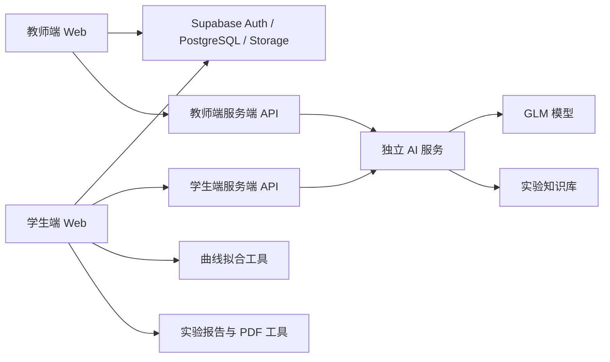
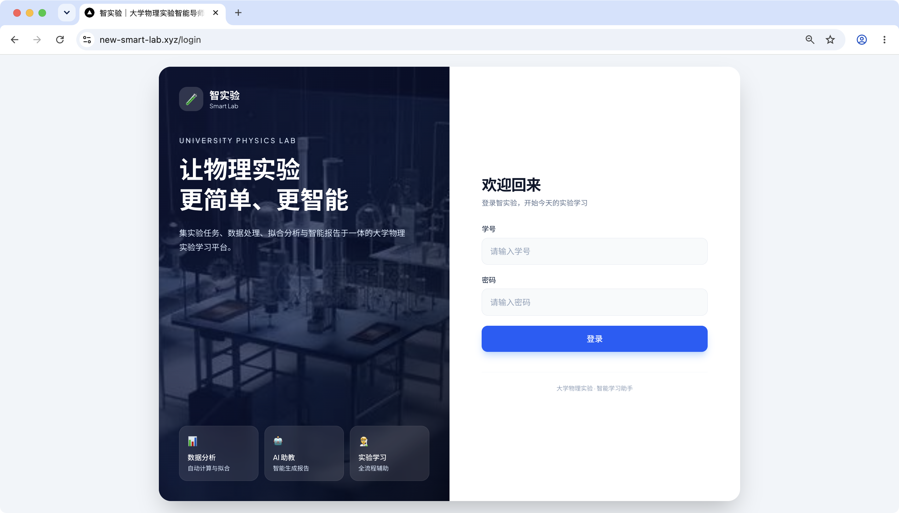
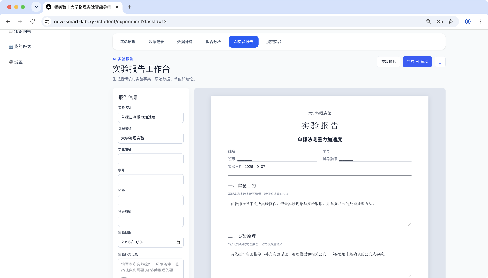
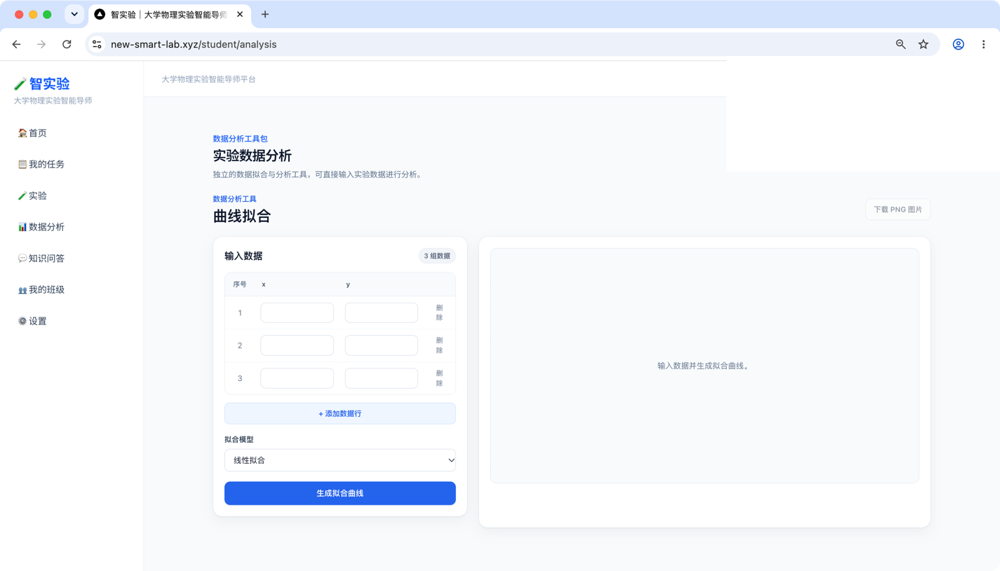
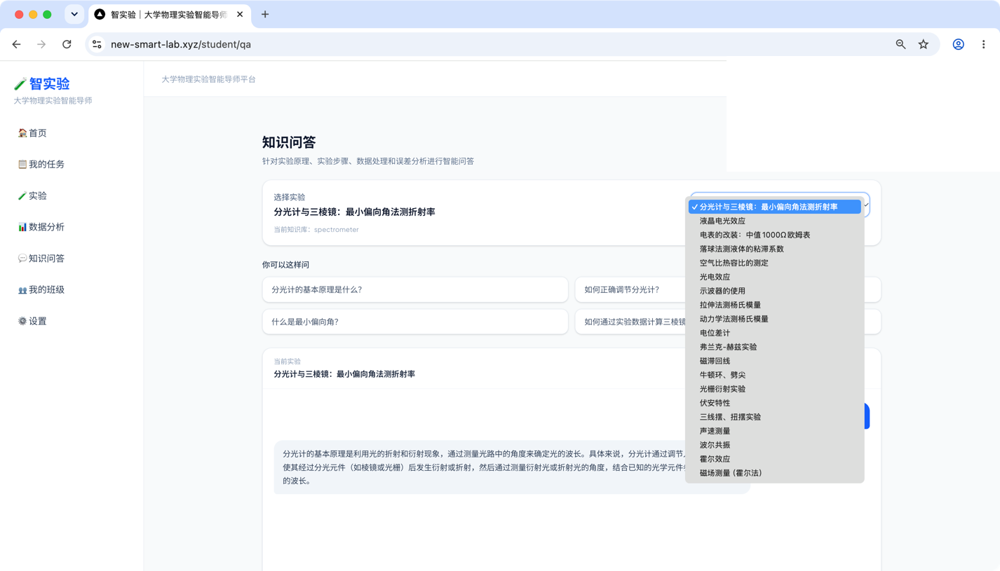
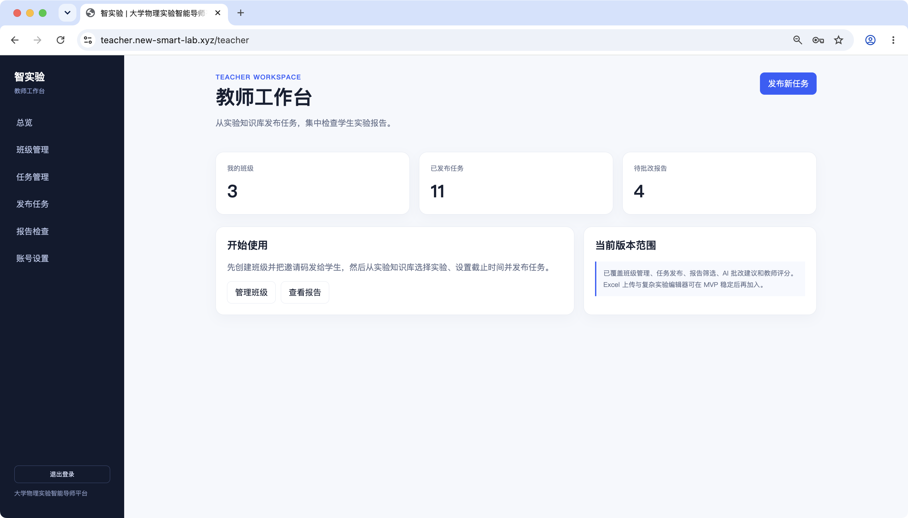
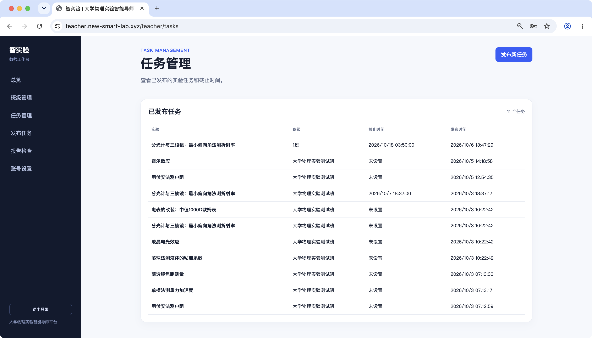
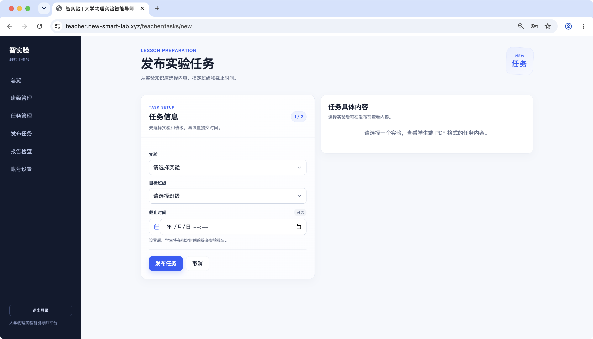

# 智实验 Smart Lab

> 高校实验教学 AI 多智能体实验导师系统

智实验面向大学物理实验教学，覆盖实验前预习、实验中数据处理、实验后报告生成与教师批改，帮助学生完成从“理解实验”到“提交报告”的完整学习闭环，也帮助教师集中管理班级、任务和实验报告。

## 项目概览

系统由学生端、教师端、AI 服务、Supabase 数据服务和实验工具包组成：



AI 服务只在服务端持有模型密钥；浏览器不会直接访问 GLM。数据拟合使用确定性算法，AI 负责知识解释、问答和报告组织，教师保留最终评分权。

## 功能

### 学生端

- 登录、个人信息和班级邀请码加入
- 查看实验任务、截止时间和完成状态
- 查看实验原理、实验内容和操作步骤
- 按当前实验进行 AI 知识问答
- 录入测量数据、绘制曲线、选择拟合模型
- 查看斜率、截距、R²、残差等拟合结果
- 生成可编辑的实验报告草稿
- 导出 PDF、提交报告并查看教师评分与评语

### 教师端

- 创建班级、管理学生和发布实验任务
- 查看报告队列、提交状态和班级筛选
- 查看报告正文、原始数据和计算结果
- 调用 AI 生成结构化审阅建议
- 对数据质量、计算一致性和结论一致性进行复核
- 教师确认分数和评语后，将报告标记为已批改

### AI 与算法

- 知识库检索增强问答，支持指定实验或通用实验问答
- 基于实验资料、原始数据和计算结果生成报告草稿
- 为教师返回结构化审阅建议，不代替教师给最终分数
- 线性拟合、非线性拟合和指标计算由 TypeScript 算法工具负责
- 报告生成与 PDF 导出由独立工具包负责

当前知识库已登记以下实验标识：

```text
air-specific-heat-ratio       photoelectric-effect
oscilloscope                  liquid-crystal-electro-optic
tensile-young-modulus        dynamic-young-modulus
potentiometer                 franck-hertz
hysteresis-loop               newtons-rings-wedge
grating-diffraction           spectrometer
voltammetry                   meter-modification
falling-ball-viscosity        trifilar-torsion-pendulum
speed-of-sound                forced-resonance
hall-effect                   hall-magnetic-field
```

## 仓库与分支

当前采用按模块分支协作，所有分支位于同一 GitHub 仓库：

| 模块 | 作用 | 推荐分支或目录 |
| --- | --- | --- |
| 学生端 | 学生任务、实验、问答、报告与提交 | `student-frontend` |
| 教师端 | 班级、任务、报告查看和批改 | 教师端项目分支 |
| AI 服务 | 知识检索、GLM 调用和报告审阅 | `ai-service` / `smart-lab-ai-service-new` |
| 曲线拟合工具 | 拟合算法和曲线可视化 | `smart-lab-fit-toolkit` 或学生端内置 `fit-toolkit` |
| 报告工具 | 报告编辑、PDF 导出和提交 | `smart-lab-report-toolkit` |
| 教师批改工具 | 可复用的教师报告批改工作台 | `smart-lab-teacher-review-toolkit` |

各模块可以独立开发和部署；合并前请确认依赖路径、环境变量和 Supabase 表结构保持一致。

## 本地开发

### 学生端

进入学生端项目根目录：

```bash
npm install
cp .env.example .env.local
npm run dev
```

学生端的 `.env.local` 至少需要：

```env
NEXT_PUBLIC_SUPABASE_URL=https://你的项目.supabase.co
NEXT_PUBLIC_SUPABASE_PUBLISHABLE_KEY=你的公开键
AI_SERVICE_URL=https://你的-ai-service域名
AI_SERVICE_TOKEN=与AI服务的INTERNAL_API_TOKEN相同
```

`AI_SERVICE_TOKEN` 只能放在服务端环境变量中，不能使用 `NEXT_PUBLIC_` 前缀。

### 教师端

```bash
npm install
cp .env.example .env.local
npm run dev
```

教师端使用同一个 Supabase 项目，并配置同样的 `AI_SERVICE_URL` 和 `AI_SERVICE_TOKEN`。正式环境不要把 GLM 密钥放到教师端或学生端代码仓库。

### AI 服务

进入 `smart-lab-ai-service-new`：

```bash
npm install
cp .env.example .env
npm run typecheck
npm test
npm run dev
```

AI 服务环境变量：

```env
PORT=8787
HOST=0.0.0.0
AI_MODE=glm
GLM_API_KEY=你的智谱密钥
GLM_MODEL=glm-4-flash
GLM_BASE_URL=https://open.bigmodel.cn/api/paas/v4/chat/completions
INTERNAL_API_TOKEN=随机生成的服务间令牌
KNOWLEDGE_BASE_INDEX_PATH=knowledge-base/index.json
```

生成内部令牌：

```bash
openssl rand -hex 32
```

健康检查：

```bash
curl http://localhost:8787/health
```

公网部署可使用 Railway。项目已包含 `Dockerfile`，部署后将 Railway 域名填入学生端和教师端的 `AI_SERVICE_URL`。

## AI 接口

AI 服务要求使用服务间令牌：

```http
Authorization: Bearer <INTERNAL_API_TOKEN>
```

主要接口：

| 方法 | 路径 | 用途 |
| --- | --- | --- |
| `GET` | `/health` | 检查服务、模式和模型配置 |
| `GET` | `/v1/experiments` | 查看已注册实验 |
| `POST` | `/v1/ai/qa` | 学生知识问答，`experimentId` 可选 |
| `POST` | `/v1/ai/report-draft` | 根据知识库和学生数据生成报告草稿 |
| `POST` | `/v1/ai/review-draft` | 教师端结构化审阅报告 |
| `POST` | `/v1/analysis` | 执行确定性实验数据分析 |

具体实验页面传稳定的知识库 ID，例如：

```json
{
  "experimentId": "photoelectric-effect",
  "question": "遏止电压和入射光频率有什么关系？",
  "history": []
}
```

不要把 Supabase 的自增 `experiments.id` 直接当作 AI 的 `experimentId`。数据库应使用 `experiments.knowledge_id` 映射知识库 ID。

## Supabase 初始化

在 Supabase SQL Editor 中按项目实际状态执行迁移。新项目建议顺序：

1. `smart-lab-teacher/supabase/migrations/001_init.sql`
2. `smart-lab-teacher/supabase/migrations/002_hardening.sql`
3. `smart-lab-teacher/supabase/migrations/003_security_and_integrity.sql`
4. `smart-lab-teacher/supabase/seed.sql`
5. `smart-lab-ai-service-new/integration/supabase/migrations/003_add_experiment_knowledge_id.sql`
6. `smart-lab-ai-service-new/integration/supabase/seed_knowledge_experiments.sql`

已有线上数据库不要重复执行旧迁移。执行 AI 知识库种子前，先确认现有实验是否需要回填 `knowledge_id`，避免新增重复实验记录。

核心业务表：

```text
users          用户与角色
classes        教学班级
class_members  班级成员
experiments    实验资料与 knowledge_id
tasks          班级实验任务
reports        学生报告、教师评分与批改结果
```

报告状态为：

```text
draft -> submitted -> graded
```

Supabase RLS 负责限制学生只能访问自己的报告，教师只能查看和批改自己班级的报告。

## 部署结构

推荐使用独立子域名：

```text
学生端：student.example.com
教师端：teacher.example.com
AI 服务：ai.example.com 或 Railway 默认域名
```

学生端和教师端可以分别部署到 Vercel，AI 服务部署到 Railway。自定义域名只负责访问入口，不改变 Supabase 和 AI 服务的接口关系。

上线前检查：

- Vercel 的 Root Directory 指向对应前端项目根目录
- 学生端和教师端使用同一个 Supabase 项目
- 两端都配置 `AI_SERVICE_URL` 和 `AI_SERVICE_TOKEN`
- Railway 的 `/health` 返回 `aiMode: "glm"` 和 `aiConfigured: true`
- `experiments.knowledge_id` 与 AI 知识库中的 `experimentId` 一致
- Supabase Auth Redirect URLs 包含学生端和教师端正式地址
- `.env`、`.env.local`、GLM 密钥和服务令牌没有提交到 GitHub

## 页面截图

以下截图来自学生端和教师端的实际页面，已将测试用户头像、姓名和学号等信息脱敏。图片保存在仓库的 [`docs/screenshots/`](docs/screenshots/) 目录中，GitHub 会自动渲染这些相对路径。

### 学生端









### 教师端







公开截图前仍需确认没有出现真实姓名、邮箱、学号、班级邀请码、密码、GLM API Key、`AI_SERVICE_TOKEN` 或 Supabase service role key。正式部署地址和演示账号建议单独通过团队私下渠道发送。


## 许可证与说明

本项目用于大学物理实验教学实践和课程/竞赛演示。